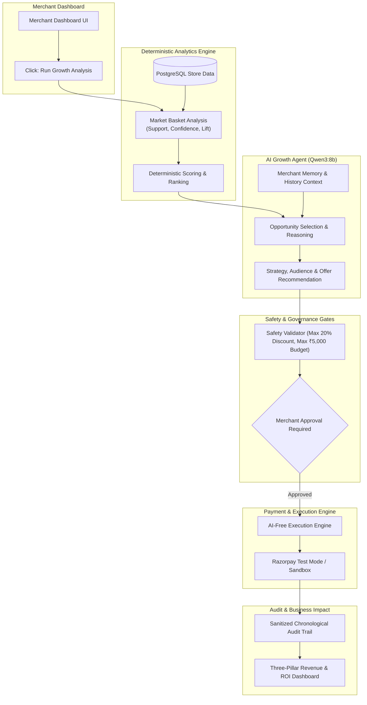

# RevGen — AI Merchant Growth / Upsell & Cross-Sell Agent

> **Submission for Razorpay Buildathon — Track 1: AI Growth & Agentic Commerce**  
> *An autonomous, safety-bounded AI merchant growth agent with deterministic PostgreSQL analytics, local Qwen3:8b intelligence, human-in-the-loop campaign governance, and Razorpay Test Mode execution.*

---

## 📹 Demo Video

> **📺 Demonstration Video**: *[Link to Demo Video](https://youtube.com) (Add your video URL here)*

---

## 🎯 What is RevGen?

**RevGen** solves the revenue growth bottleneck for online merchants by automating upsell and cross-sell discovery while ensuring strict safety and human control:

1. **Deterministic Analytics**: Evaluates 100% of historical transactions using association rule mining (Support, Confidence, Lift) with zero mathematical hallucinations.
2. **AI Growth Reasoning**: Uses local **Qwen3:8b** via Ollama to evaluate candidate opportunities, explain why an opportunity matters, and generate targeted marketing strategies.
3. **Safety Guardrails**: Automatically enforces strict discount limits ($\le 20\%$) and budget caps ($\le ₹5,000$).
4. **Human-in-the-Loop Governance**: AI cannot execute money actions on its own — explicit merchant approval is required before any campaign moves forward.
5. **Razorpay Test Mode Execution**: Converts discounted prices to INR paise and executes safe test transactions via Razorpay Test Mode with strict idempotency and failure recovery.
6. **Transparent Revenue Metrics**: Clearly separates **Estimated Opportunity** vs **Test Transaction Value** vs **Real Merchant Revenue (₹0.00)**.

---

## 🌟 Key Design Principle

> **"Deterministic analytics provide the numerical evidence, while AI provides the business reasoning. The AI recommends, but the merchant remains in control."**

---

## 🏗️ Architecture Overview



---

## 📂 Implementation Codebase

The complete application implementation is located in the [`/revgen`](./revgen) directory:

- **[Full Documentation & Architecture Guide](./revgen/README.md)**
- **[Backend Express Server & AI Orchestration](./revgen/backend)**
- **[PostgreSQL Schema & Seed Data Generator](./revgen/database)**
- **[Single-Page Merchant Dashboard Frontend](./revgen/frontend)**
- **[Automated Regression Test Suites (161 Tests)](./revgen/backend/test)**

---

## ⚡ Quick Start

```bash
# 1. Clone repository
git clone https://github.com/RoopinNayak/Revgen.git
cd Revgen/revgen

# 2. Install backend dependencies & configure env
cd backend
npm install
cp .env.example .env

# 3. Seed PostgreSQL database (3,000 orders)
cd ../database
npm install
node seed.js

# 4. Start backend server
cd ../backend
npm start
```

Visit the dashboard in your browser: **[http://localhost:3000](http://localhost:3000)**

---

## 🧪 Automated Test Suite (161/161 PASS)

RevGen includes 8 comprehensive automated test suites covering all architectural layers:

```bash
cd revgen/backend
npm test
```

```
============================================================
REVGEN FULL REGRESSION SUITE: 161 / 161 PASSED (100%)
============================================================
  ✅ Stage 2 — Autonomous Opportunity Selector:     20 / 20 PASS
  ✅ Stage 3 — AI Campaign Recommendation Agent:   20 / 20 PASS
  ✅ Stage 4 — On-Demand Growth Orchestrator:      20 / 20 PASS
  ✅ Stage 5 — Agent Memory & Explainability:       20 / 20 PASS
  ✅ Stage 6 — Razorpay Test Mode Foundation:       20 / 20 PASS
  ✅ Stage 7 — Razorpay Campaign Execution:         20 / 20 PASS
  ✅ Stage 8 — Revenue & Transaction Dashboard:     21 / 21 PASS
  ✅ Stage 9 — Failure Handling & Audit Trail:      20 / 20 PASS
============================================================
```

---

## 📜 License

ISC License. Built for the **Razorpay Buildathon 2026**.
